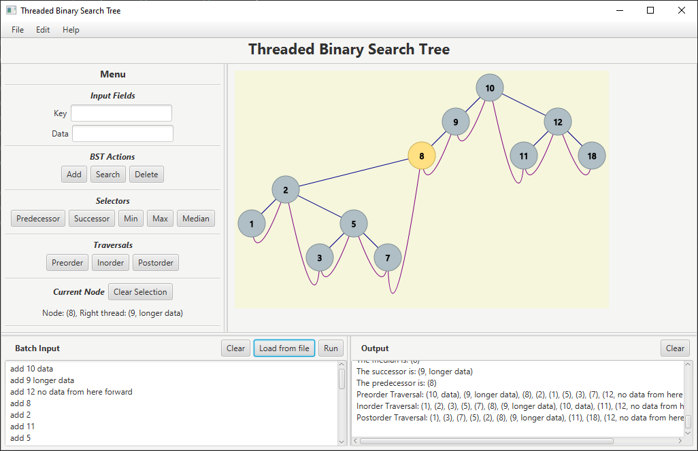

# Threaded Binary Search Tree Visualization App

Threaded Binary Search Tree implementation with GUI interaction and visualization

The threads are used to access predecessors and seccussors in O(1) time (further reading at [geeksforgeeks](https://www.geeksforgeeks.org/threaded-binary-tree/))

## Batch Commands 

The supported commands are:

- `add key data` - ( e.g. `add 17 some data to save in node with key 17` )
- `add key` - ( e.g. `add 17` )
- `delete key` - ( e.g. `delete 17` )
- `search key` - ( e.g. `search 17` )
- `min`
- `max`
- `median`
- `successor`
- `predecessor`
- `preorder`
- `inorder`
- `postorder`

Example file `batch input example.txt`

## Build instructions

Build as any standard JavaFX Project

